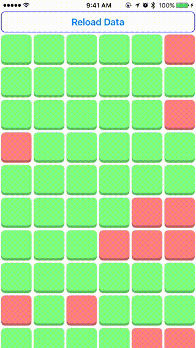

Just a simple switch-like `UIControl` that detects force and only toggles past a certain threshhold (similar to the way peek/pop behaves). Rough around the edges!

Demo video made using ffmpeg:

`ffmpeg -y -i demo_original.mov -vf fps=60,scale=750:-1:flags=lanczos,palettegen palette.png`

`ffmpeg -i demo_original.mov -i palette.png -filter_complex "fps=30,scale=400:-1:flags=lanczos[x];[x][1:v]paletteuse" demo.gif`